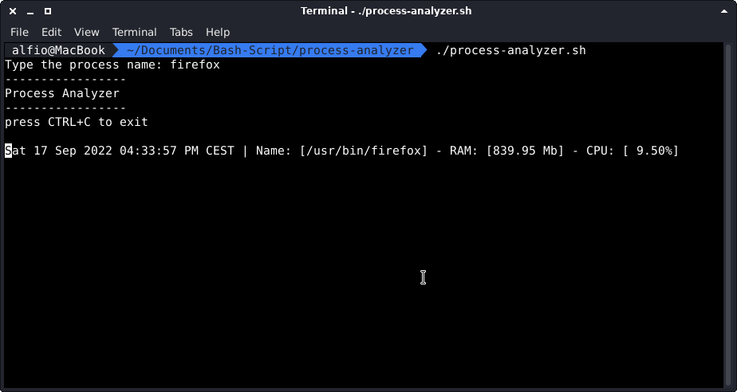

# process-analyzer
Analyze the ram and cpu usage of a process in real time.

## Installation
- `sudo ln -s /path/to/process-analyzer.sh /usr/local/bin/process-analyzer`

## Usage
- `process-analyzer [-n] 5` to refresh every 5 seconds

# Author:
process-analyzer is written by Alfio Salanitri www.alfiosalanitri.it and are licensed under the terms of the GNU General Public License, version 2 or higher.

